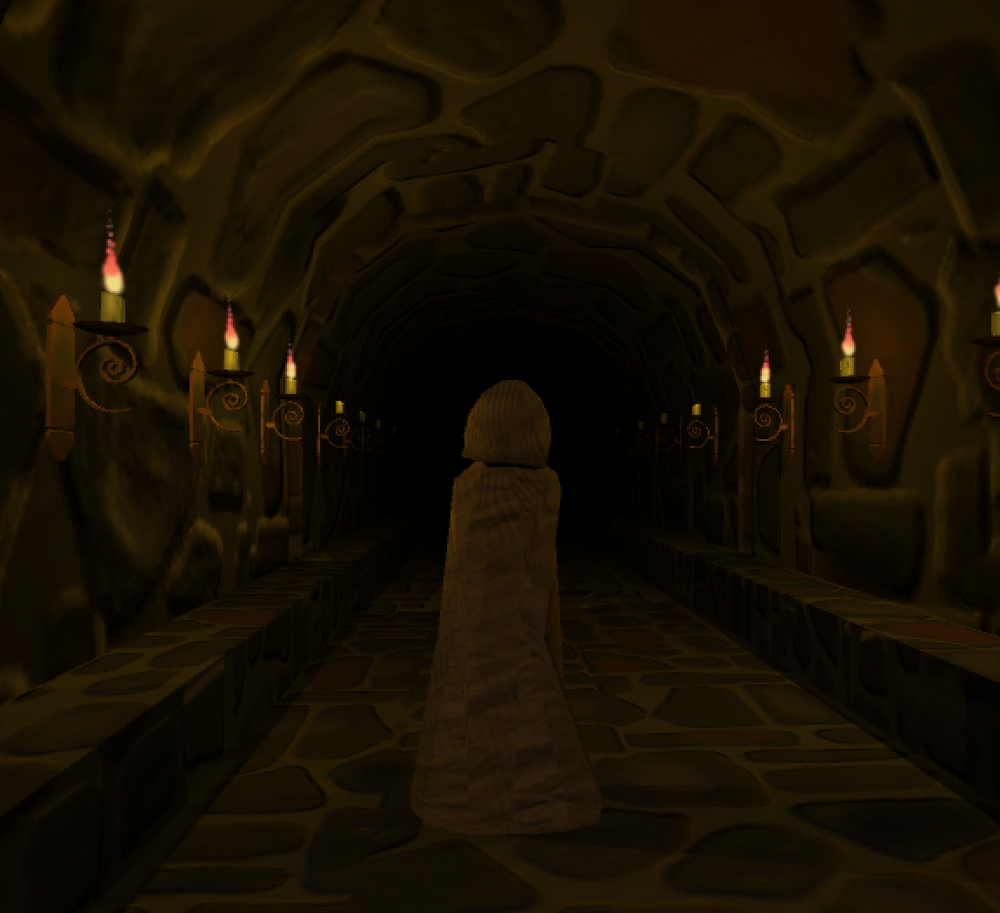

# Monkey Muck

This was a final project for a "3D modeling" class I took back in college.

It's a small Unity demo featuring some characters and environments that I modeled and animated in Maya.

The player-controlled character in the demo isn't the main star. That's the monster you'll find lurking the halls.

## Playing

A demo can be played/downloaded from https://scottnm.itch.io/muck

## Versions

### v0.2.1 - commit hash 781c6da
I managed to get the project building as a WebGL project so that I could upload it to the old itch.io page and it could be played in browser.

Pretty cool stuff. Had to fix the compression settings but otherwise everything was super clean.

You can now run the demo online at https://scottnm.itch.io/muck

### v0.2.0 - commit hash fc73f01

In 2022, I was doing some spring cleaning of old github repos and wanted to see if I could still run this.

Sadly the original `v0.1.0` version could only be built with Unity 5.4.0. That's still available, but I didn't want to go install it so instead I upgrade the project to Unity 2021 just to see how well that would work.

It worked surprisingly well! You can build and run this yourself from the unity editor. You just need to make sure you have Unity 2021.3.2f installed. You can follow the "Building from source" link below for more info.

I do not have a pre-built binary for this version.

### v0.1.0 - commit hash df03b89

This is the original version that I submitted for the class and which can be downloaded on my [itch.io page](https://scottnm.itch.io/muck).

## Building from source

All of the interesting source (i.e. the unity project) lives in the `VirtualEnvironment` directory.

Just open that up in Unity2021.3.2f and you should be good to run it from the UnityEditor or make a full build.
